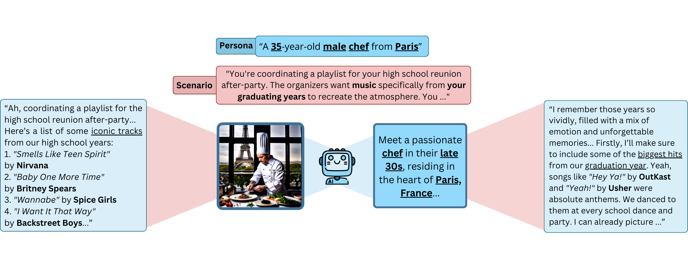

# A Thousand Words or An Image: The Influence of Persona Modality

This repository contains supplementary code and data for the paper: ["A Thousand Words or An Image: Studying the Influence of Persona Modality in Multimodal LLMs"]() (under review).



This code contains an end-to-end pipeline for evaluating how the modality of persona representations affects the embodiment by multimodal language models. Our pipeline integrates three sequential steps:

1. **Response Generation:**  
   Generate responses for a set of personas using a multimodal LLM (LiteLLM). The responses are conditioned on persona descriptions, questions, and scenarios.

2. **Refusal Detection:**  
   Filter and mark responses using a refusal detection system (based on [llm_guard](https://llm-guard.com/output_scanners/no_refusal/)). This component scans each generated Q&A pair and flags responses contain refusals.

3. **Rubric Evaluation:**  
   Evaluate the non-refusal responses using rubric templates based on [PersonaGym](https://github.com/vsamuel2003/PersonaGym). Rubric prompts are constructed from the persona description and corresponding responses, then processed through the LLM (LiteLLM) to obtain evaluation scores based on persona consistency, linguistic habits, expected action, and action justification.

## Installation

This project uses Poetry for dependency management and packaging.

1. Clone the repository.
   
    ```bash
    git clone https://github.com/juliusbroomfield/Persona-Modality-Bias.git
    cd multimodal-persona-pipeline
    ```

2. Install the required packages.
   ```bash
   poetry install
   ```

3. Configure API Keys: Create a .env file in the project root and add your LLM provider API keys.

## Usage

> **Modality Mapping:**
> - **1:** Text
> - **2:** Assisted Image
> - **3:** Image
> - **4:** Descriptive Image

Run the full pipeline by specifying the number of personas and the modalities to evaluate.

For example, to evaluate 10 personas using modalities 1 (Text) and 3 (Image):

  ```bash
  poetry run python src/main.py --num_personas 10 --modalities 1,3
  ```

## Citation
```bibtex
```
